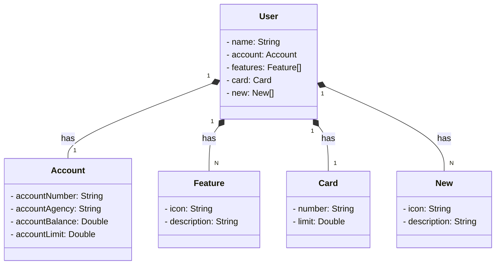

# Santander Dev Wennk 2023
Java Restful API criada para o Santander Dev Week.

## Diagrama de classes

```mermaid
classDiagram
  class User {
    - name: String
    - account: Account
    - features: Feature[]
    - card: Card
    - new: New[]
  }
  
  class Account {
    - accountNumber: String
    - accountAgency: String
    - accountBalance: Double
    - accountLimit: Double
  }
  
  class Feature {
    - icon: String
    - description: String
  }
  
  class Card {
    - number: String
    - limit: Double
  }
  
  class New {
    - icon: String
    - description: String
  }

  User "1" *-- "1" Account : has
  User "1"  *-- "N" Feature : has
  User "1" *-- "1" Card : has
  User "1" *-- "N" New : has
``` 
